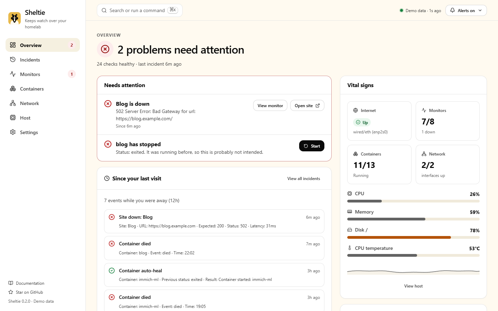
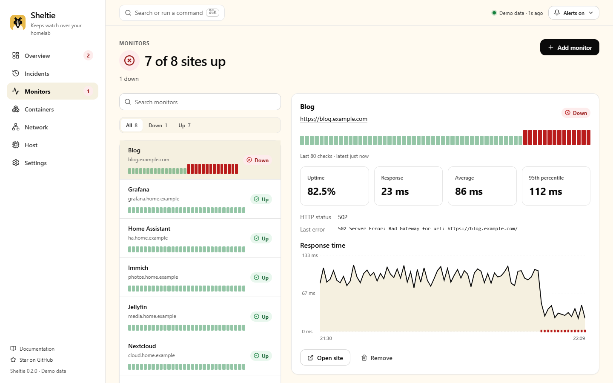
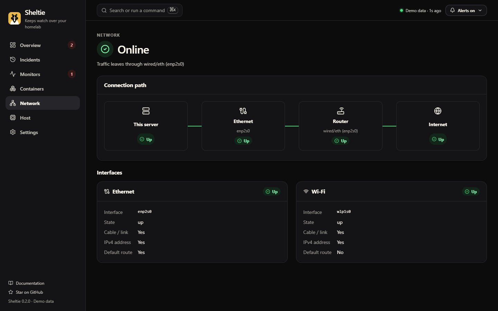
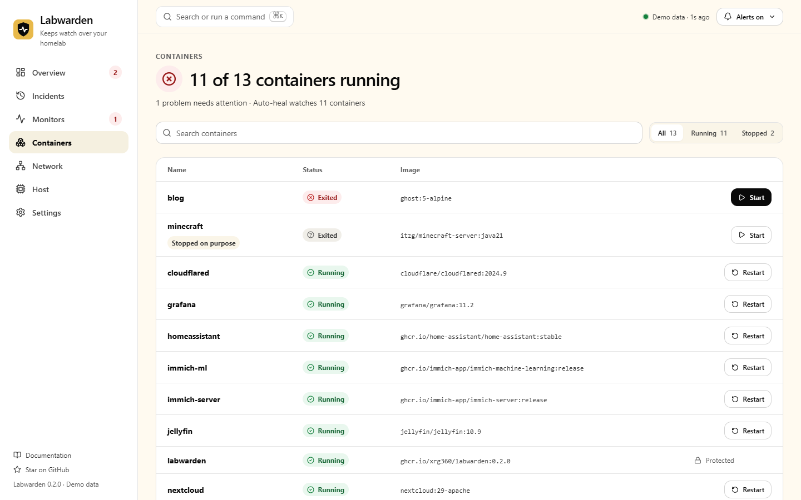
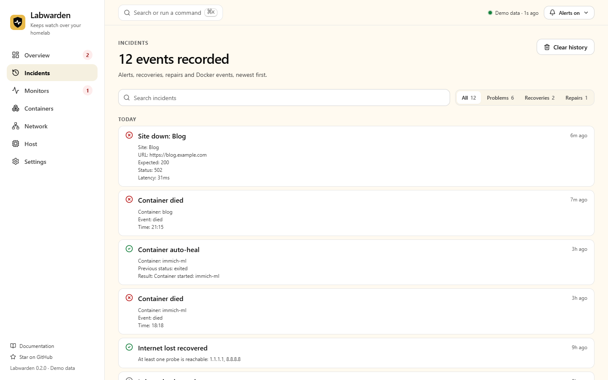

<p align="center">
  
</p>

<h1 align="center">Meerkat</h1>

<p align="center">
  <strong>Know what happened while you were offline.</strong><br>
  Open-source monitoring for Docker homelabs: websites, containers, network failover and host health,<br>
  with quiet Telegram alerts, safe auto-heal, and a calm dashboard that tells you what's wrong and how to fix it.
</p>

<p align="center">
  <a href="https://github.com/xrg360/meerkat/actions/workflows/ci.yml"></a>
  <a href="LICENSE"></a>
  <a href="https://github.com/xrg360/meerkat/stargazers"></a>
  <a href="https://meerkat.simplewebsite.in/demo/"></a>
  <a href="CONTRIBUTING.md"></a>
</p>

<p align="center">
  <a href="https://meerkat.simplewebsite.in/demo/"><strong>Try the live demo</strong></a> ·
  <a href="https://meerkat.simplewebsite.in">Website</a> ·
  <a href="https://meerkat.simplewebsite.in/docs/">Docs</a> ·
  <a href="docs/ROADMAP.md">Roadmap</a> ·
  <a href="CONTRIBUTING.md">Contribute</a>
</p>



## Why Meerkat?

Most dashboards show you numbers and leave the thinking to you. Meerkat answers three questions, in this order, on any screen:

1. **Is anything wrong?** Every page opens with a plain sentence: "2 problems need attention", "7 of 8 sites up", "Internet is unreachable".
2. **What happened while I was away?** "Since your last visit" summarizes outages, recoveries, crashed containers and automatic repairs.
3. **What should I do?** Every problem comes with the button that fixes it: start the crashed container, open the failing site, silence alerts for an hour.

Meerkats are natural lookouts: one watches the horizon and warns the group early, without constant panic. Meerkat does the same for your homelab.

## Quick start

```bash
mkdir -p meerkat/config meerkat/state && cd meerkat
curl -fsSL https://github.com/xrg360/meerkat/raw/master/config/config.yml -o config/config.yml
docker run -d --name meerkat --restart unless-stopped --privileged --network host \
  -v /var/run/docker.sock:/var/run/docker.sock:ro \
  -v $(pwd)/config:/app/config -v $(pwd)/state:/app/state \
  ghcr.io/xrg360/meerkat:latest
```

Open `http://<server-ip>:8710`. The action token is printed once in `docker logs meerkat`. Add Telegram with two environment variables (see [Telegram](#telegram-botfather-commands)).

## Features

| | |
|---|---|
| **Answer-first dashboard** | Overview, Incidents, Monitors, Containers, Network, Host and Settings. Light, dark and system themes. Works great on phones. |
| **Since your last visit** | A short report of everything that happened while you were away. |
| **Fix it from the alert** | Problems carry actions, protected by an action token and a confirmation. Undo when you remove a monitor. |
| **Docker events and auto-heal** | Container created/started/stopped/died events. Crashed containers are restarted; containers you stopped on purpose are left alone. |
| **Network failover awareness** | Ethernet and Wi-Fi state, default-route changes and internet reachability, shown as a connection path. |
| **Website and service checks** | HTTP status, latency, redirects and keyword checks, with uptime bars, average and p95 response time. |
| **Host health** | CPU, RAM, disk and CPU temperature with thresholds, durations and cooldowns. |
| **Two-way Telegram** | State-change-only alerts plus `/status`, `/docker`, `/restart`, `/silence` and more. Stale commands queued during an outage are ignored safely. |
| **Silence with expiry** | Silence alerts for 1 hour, 4 hours or until resumed, from the dashboard or Telegram. |
| **Fast for experts** | `⌘K` command palette, `g`-shortcuts, REST API and Prometheus `/metrics`. |
| **Private and accessible** | No telemetry or external requests from the dashboard. WCAG 2.2 AA checked in CI on every page. |

Planned next: an offline alert outbox with a "while you were away" digest, power-cut forensics on boot, an off-site Sentinel, UPS awareness and a plugin system. See the [roadmap](docs/ROADMAP.md).

<table>
  <tr>
    <td width="50%"></td>
    <td width="50%"></td>
  </tr>
  <tr>
    <td></td>
    <td></td>
  </tr>
</table>

## How it compares

| | Uptime Kuma | Beszel | Netdata | **Meerkat** |
|---|---|---|---|---|
| Website / endpoint checks | ✅ many types | — | partial | ✅ |
| Host health | — | ✅ | ✅✅ | ✅ |
| Docker crash events + auto-heal | — | stats only | stats | ✅ intent-aware |
| Network failover awareness | — | — | partial | ✅ |
| "What happened while I was away" | per monitor | — | alert log | ✅ |
| Fix-it actions from the dashboard and Telegram | — | — | — | ✅ |
| Public status pages | ✅✅ | — | — | planned |

Meerkat is designed to run alongside these tools. Full comparisons: [features](docs/COMPETITIVE_ANALYSIS.md) and [UX](docs/UX_COMPETITIVE_ANALYSIS.md).

## Defaults to change

The sample config and Compose file use example values. Change them to match your host:

- Ethernet: `enp2s0` (find yours with `ip -br link`)
- Wi-Fi: `wlp1s0` (remove the `network` entries you do not have; both are optional)
- Timezone: `Asia/Kolkata` (`TZ` in `compose.yml`)

## Docker Compose

Create a project directory:

```bash
mkdir -p /opt/meerkat/config /opt/meerkat/state
cd /opt/meerkat
```

Create `compose.yml`:

```yaml
services:
  meerkat:
    image: ghcr.io/xrg360/meerkat:latest
    container_name: meerkat
    restart: unless-stopped
    privileged: true
    network_mode: host
    volumes:
      - /var/run/docker.sock:/var/run/docker.sock:ro
      - ./config:/app/config
      - ./state:/app/state
    environment:
      TZ: Asia/Kolkata
      PORT: 8710
      MEERKAT_API_PORT: 8711
      MEERKAT_API_BASE: http://127.0.0.1:8711
      TELEGRAM_BOT_TOKEN: ${TELEGRAM_BOT_TOKEN}
      TELEGRAM_CHAT_ID: ${TELEGRAM_CHAT_ID}
      MEERKAT_ACTION_TOKEN: ${MEERKAT_ACTION_TOKEN}
```

Create `.env`:

```env
TELEGRAM_BOT_TOKEN=
TELEGRAM_CHAT_ID=
MEERKAT_ACTION_TOKEN=change-this-long-random-token
```

Create `config/config.yml` using the configuration example below, then start Meerkat:

```bash
docker compose up -d
```

Web app and API:

```text
http://<server-ip>:8710/            Dashboard (Overview, Incidents, Monitors, Containers, Network, Host, Settings)
http://<server-ip>:8711/api/status  Python API
http://<server-ip>:8711/metrics     Prometheus metrics
```

The Next.js web app is served on port `8710`. The Python monitor API runs internally on `8711`, and the web app proxies backend requests through `/api/meerkat/*` using `MEERKAT_API_BASE=http://127.0.0.1:8711`.

View logs:

```bash
docker logs -f meerkat
```

Stop:

```bash
docker compose down
```

Update:

```bash
docker compose pull
docker compose up -d
```

Backup state:

```bash
tar -czf meerkat-state-backup.tar.gz state
```

## Docker CLI

```bash
docker run -d \
  --name meerkat \
  --restart unless-stopped \
  --privileged \
  --network host \
  -e TZ=Asia/Kolkata \
  -e TELEGRAM_BOT_TOKEN=your-token \
  -e TELEGRAM_CHAT_ID=your-chat-id \
  -e MEERKAT_ACTION_TOKEN=change-this-long-random-token \
  -v /var/run/docker.sock:/var/run/docker.sock:ro \
  -v $(pwd)/config:/app/config \
  -v $(pwd)/state:/app/state \
  ghcr.io/xrg360/meerkat:latest
```

Build locally from source:

```bash
git clone https://github.com/xrg360/meerkat.git
cd meerkat
docker compose up -d --build
```

## Local Development

Run the Python monitor API on the internal API port:

```bash
MEERKAT_API_PORT=8711 python app.py
```

PowerShell:

```powershell
$env:MEERKAT_API_PORT = "8711"
python app.py
```

In another terminal, run the Next.js web app:

```bash
npm install
npm run dev
```

Open:

```text
http://127.0.0.1:8710/
```

If the Python API is not running, the dashboard still loads, shows a clear "Can't reach Meerkat" banner and keeps the last known state.

To work on the dashboard without a backend, use simulated data:

```bash
npm run dev:demo
```

Before changing the UI, read [DESIGN.md](DESIGN.md).

## Telegram BotFather Commands

Meerkat reads these Telegram commands from your configured `TELEGRAM_CHAT_ID`:

```text
start - Show Meerkat bot info
status - Show current monitor state
health - Show CPU RAM disk and temperature
network - Show interface and internet state
docker - Show Docker containers
sites - Show website monitors
addsite - Add a website monitor. Usage: /addsite name https://example.com
removesite - Remove a runtime website monitor. Usage: /removesite name
restart - Restart a Docker container. Usage: /restart container_name
clearcache - Clear Linux RAM caches
silence - Pause monitor alerts
resume - Resume monitor alerts
help - Show available commands
```

Commands that change something (`/restart`, `/clearcache`, `/addsite`, `/removesite`, `/silence`, `/resume`) are ignored if they are older than `telegram.command_max_age` (5 minutes by default). This stops a command sent during an outage from running hours later. Meerkat replies to say the command was ignored.

In BotFather:

```text
/setcommands
```

Select your Meerkat bot, then paste the command list above.

## Telegram Troubleshooting

Set either env naming style:

```env
TELEGRAM_BOT_TOKEN=123456:abc...
TELEGRAM_CHAT_ID=123456789
```

or:

```env
MEERKAT_TELEGRAM_BOT_TOKEN=123456:abc...
MEERKAT_TELEGRAM_CHAT_ID=123456789
```

After `docker compose up -d --build`, check:

```bash
docker logs meerkat | grep Telegram
```

Expected when configured:

```text
Telegram enabled for chat_id=...
Telegram command listener connected as @...
Telegram command listener started
```

If you see `Telegram is disabled`, the container did not receive the token/chat id. If messages send but commands do not respond, send `/start` to the bot once from the configured chat and confirm the `TELEGRAM_CHAT_ID` matches that chat.

## Configuration

```yaml
telegram:
  bot_token:
  chat_id:
  command_max_age: 5m  # destructive commands older than this are ignored

network:
  ethernet: enp2s0
  wifi: wlp1s0

cpu:
  threshold: 90

ram:
  threshold: 90

disk:
  threshold: 90
  paths:
    - /

temperature:
  threshold: 80

internet:
  hosts:
    - 1.1.1.1
    - 8.8.8.8
  timeout: 2
  severity: critical

alerting:
  duration: 0
  cooldown: 15m

api:
  enabled: true
  host: 0.0.0.0
  port: 8711

actions:
  enabled: true
  token:
  blocked_containers:
    - meerkat

auto_heal:
  enabled: true
  interval: 300
  repair_cooldown: 300
  containers:
    enabled: true
  network:
    enabled: true

sites:
  - name: Example
    url: https://example.com
    expected_status:
      - 200
    timeout: 10
    follow_redirects: true
    severity: critical
    duration: 30s
    cooldown: 15m

interval: 30
```

## Website Monitoring

Meerkat can monitor public websites or internal services in addition to the host it runs on:

```yaml
sites:
  - name: Blog
    url: https://blog.example.com
    expected_status:
      - 200
    timeout: 10
    follow_redirects: true
    keyword: "Welcome"
    severity: critical
    duration: 1m
    cooldown: 15m
```

If `keyword` is set, the site is considered up only when the HTTP status matches and the response body contains that text.

Runtime site monitors can also be added from Telegram or the web app Monitoring page:

```text
/addsite blog https://blog.example.com
/removesite blog
```

Runtime-added sites are stored in `state/state.json`. YAML-defined sites remain the recommended option for infrastructure-as-code deployments.

## Alert Behavior

Meerkat stores alert state independently from alert history:

- `state/state.json` keeps current state and dedupe markers.
- `state/history.db` keeps alert, recovery, and Docker event history.
- `alerting.duration` requires a condition to stay bad before alerting.
- `alerting.cooldown` prevents repeated messages for the same active alert.
- Recovery messages are sent only if an active alert was previously sent.

Per-monitor overrides are supported:

```yaml
cpu:
  threshold: 90
  severity: warning
  duration: 2m
  cooldown: 30m
```

## API

```text
Python API:

GET  /health
GET  /status
GET  /api/status
GET  /api/health
GET  /api/network
GET  /api/docker
GET  /api/sites
GET  /api/events
GET  /metrics
POST /clearRamCache
POST /api/actions/clear-ram-cache
POST /api/actions/docker/restart
POST /api/actions/sites/add
POST /api/actions/sites/remove
POST /api/actions/events/clear
POST /api/actions/alerts/silence    {"minutes": 60}  (omit minutes to silence until resumed)
POST /api/actions/alerts/resume

Next.js proxy (same paths under /api/meerkat/):

GET  /api/meerkat/status | health | network | docker | sites | events
POST /api/meerkat/actions/...
```

`/metrics` is Prometheus-compatible.

Action endpoints always require `X-Meerkat-Action-Token`. Set it with `MEERKAT_ACTION_TOKEN` or `actions.token`. If neither is set, Meerkat generates a random token on first start, prints it once in `docker logs meerkat`, and stores it in `state/state.json` under `api.action_token`.

`POST /api/actions/docker/restart` expects JSON:

```json
{
  "container": "cloudflared"
}
```

Example:

```bash
curl -X POST http://127.0.0.1:8710/api/meerkat/actions/docker/restart \
  -H "Content-Type: application/json" \
  -H "X-Meerkat-Action-Token: change-this-long-random-token" \
  -d '{"container":"cloudflared"}'
```

For security, action endpoints are intended for trusted LAN deployments or reverse proxies with authentication. The Meerkat container blocks restarting itself by default through `actions.blocked_containers`.

## Auto-Heal Cron

Meerkat runs an internal cron-style auto-heal loop every 5 minutes by default:

- Docker containers that were previously observed as `running` are started again if they are later found stopped, exited, or dead. Containers you stop on purpose (`docker stop`, `docker compose stop`) are left alone until they are started again.
- Configured Ethernet and Wi-Fi interfaces that were previously observed as up are bounced with `ip link set dev <interface> down/up` if they later drop. An Ethernet port with no carrier (unplugged cable) or an interface that no longer exists is not bounced.
- Repairs are recorded in event history and sent through Telegram. `/silence` mutes these messages too.
- `actions.blocked_containers` is respected, so Meerkat does not restart itself by default.

The Docker container must run with host networking and enough privileges to repair interfaces. The provided Compose file already uses `privileged: true` and `network_mode: host`.

## State Behavior

On first run Meerkat records current monitor state without sending fake recovery alerts. It does send one boot message when the Meerkat Docker container starts. After that it only sends messages when a monitor changes state:

- down
- up
- restored
- threshold exceeded
- back to normal
- Docker lifecycle event

The state file lives at `state/state.json`.

## Contributing

Meerkat is built in the open and new contributors are very welcome.

- **Good first issues:** new monitors (TLS expiry, DNS, SMART, UPS…), notifiers (Discord, ntfy, Gotify…) and repair actions are small, self-contained and listed in the [roadmap backlog](docs/ROADMAP.md#7-missing-features--contributor-backlog).
- **Start here:** [CONTRIBUTING.md](CONTRIBUTING.md) for setup and checks, [DESIGN.md](DESIGN.md) before any UI work, [AGENTS.md](AGENTS.md) if you use AI coding tools.
- **Security issues:** report privately as described in [SECURITY.md](SECURITY.md).

If Meerkat is useful to you, a ⭐ on GitHub helps other homelabbers find it.

[](https://star-history.com/#xrg360/meerkat&Date)

## License

Meerkat is licensed under the [Apache License 2.0](LICENSE).
