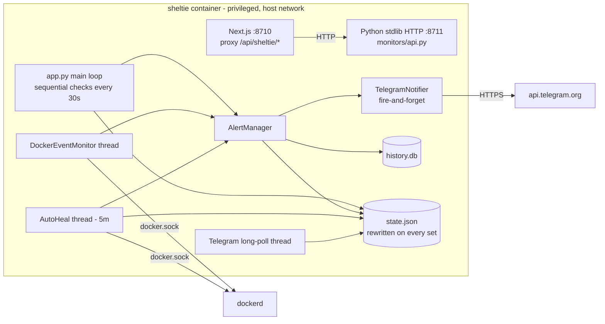
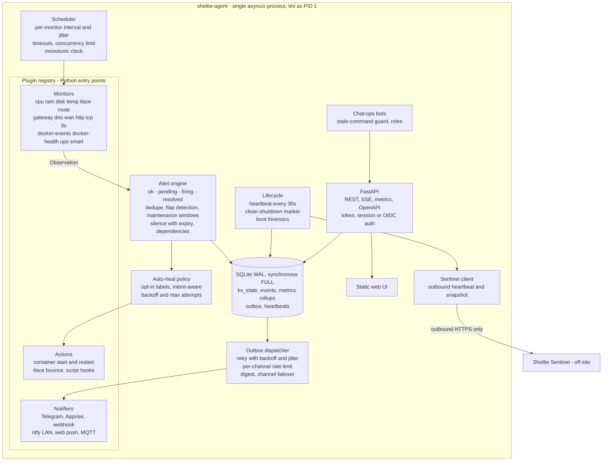
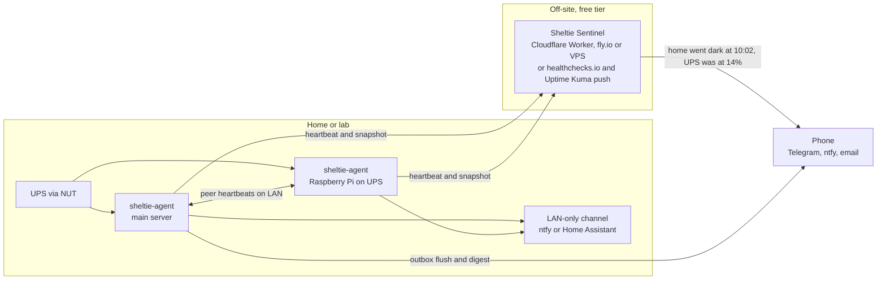
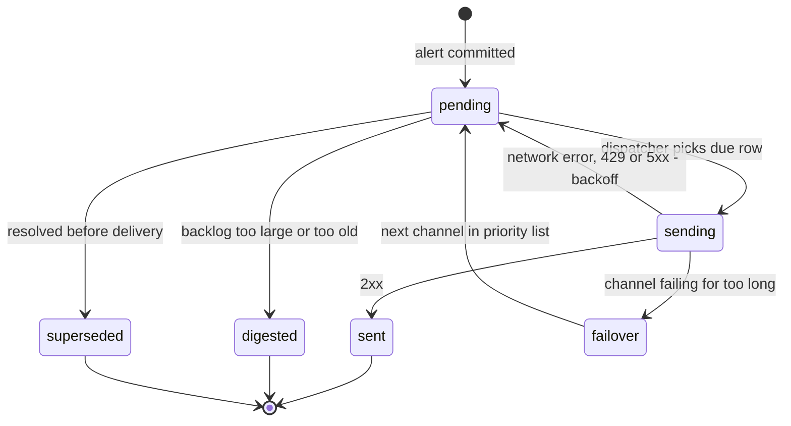
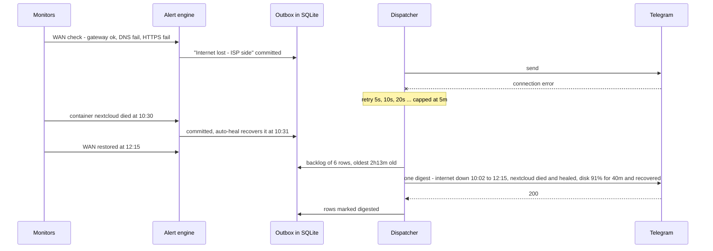
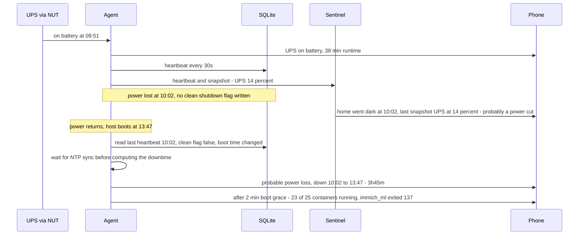

# Sheltie architecture

This document describes how Sheltie works today and the architecture it is moving towards. The target design is built around one promise: **Sheltie tells you what happened while you were offline**, whether the cause was a dropped ISP link, a power cut, or the server itself being down.

- [Current architecture](#current-architecture)
- [Target architecture](#target-architecture)
- [Failure scenarios](#failure-scenarios)
- [Plugin interface (planned)](#plugin-interface-planned)
- [Storage model (planned)](#storage-model-planned)

---

## Current architecture



| Component | File | Notes |
|---|---|---|
| Check loop | `app.py` | Runs `network`, `internet`, `cpu`, `ram`, `disk`, `temperature`, `sites` one after another, then sleeps `interval` seconds. |
| Alert engine | `monitors/alerts.py` | `condition()` (threshold with duration and cooldown), `state_change()` (value changed), `event()` (one-off). Every alert goes to history and then to Telegram. |
| State | `monitors/state.py` | A flat key/value dict persisted as JSON. |
| History | `monitors/history.py` | SQLite `events` table in WAL mode. Falls back to memory if the DB is broken. |
| Docker events | `monitors/docker.py` | Streams container lifecycle events. It also records containers stopped on purpose so auto-heal leaves them alone. |
| Auto-heal | `monitors/autofix.py` | Restarts containers that were running and then crashed, and bounces interfaces that have a link but lost their address. |
| Chat-ops | `monitors/commands.py` | Telegram long-polling. Destructive commands older than `telegram.command_max_age` (5 minutes by default) are ignored. |
| API | `monitors/api.py` | REST and Prometheus `/metrics`. Action endpoints always require a token, which is auto-generated if none is configured. |

### Known structural limits

These limits are what the target architecture removes:

1. Notifications are fire-and-forget. A Telegram send that fails during an outage is lost.
2. Writing `state.json` on every `set()` is slow, wears SD cards, and is not crash-safe.
3. Nothing records *when* the host went down or *why*.
4. Checks run in sequence, so one slow site delays every other check.
5. Two runtimes (Python and Node) share one container without a supervisor.

---

## Target architecture

The agent stays in **Python** because it is contributor-friendly, already works, and has access to Apprise's 100+ notification services. It becomes **one asyncio process** under `tini`, with the web UI served as a static Next.js export by the same process.



### Deployment topology

The design treats three failure layers separately: the WAN link, power, and the agent host itself.



### Outbox delivery

Every alert is written to the outbox in the same transaction that records it. Delivery happens afterwards and is retried until it succeeds.



- Backoff is `min(5s * 2^attempts, 5m)` with jitter, and honours Telegram's `retry_after` on 429.
- When the backlog is more than N messages or older than T, the queue collapses into a single **"While you were offline"** digest.
- Alerts that fired and recovered before they could be delivered are reported in the digest as "flapped", not sent as two separate messages.

---

## Failure scenarios

### Long network disconnection



- **Dependencies:** the WAN monitor checks the gateway, then DNS, then HTTPS endpoints. While the WAN is down, dependent site alerts are muted and added to the digest instead of paging one by one.
- **LAN channel:** ntfy or Home Assistant on the LAN still reaches phones on home Wi-Fi when the ISP is down.
- **Stale commands:** a `/restart` sent during the outage is not executed hours later. *(Implemented.)*
- **Docker stream resume:** the agent persists the last event timestamp and reconnects with `since=`.

### Long power cut



How the boot classifier decides what happened:

| Same boot ID as last heartbeat? | Clean-shutdown flag | Verdict |
|---|---|---|
| yes | no | Agent crashed or was killed |
| no | yes | Planned host reboot |
| no | no | **Power loss or kernel crash** |

- **Clock sanity:** durations use the monotonic clock. Downtime is only computed after NTP sync; otherwise it is labelled approximate. This matters on Raspberry Pi boards that have no RTC.
- **Boot storm:** Docker events during the first two minutes after boot are aggregated into one summary instead of one message per container.

### Long server downtime

The agent cannot report its own death, so the watcher must live off the host:

1. **`heartbeat.urls`**: ping healthchecks.io, an Uptime Kuma push monitor or any similar URL. This works on day one.
2. **Sheltie Sentinel**: a small open-source receiver that stores the last snapshot, so a missed heartbeat produces a contextual alert ("last seen with WAN degraded and UPS at 14%").
3. **Peer mesh**: two agents on the same LAN watch each other and alert through their own channels.
4. **Self-health**: each internal task has a watchdog, and the Docker `HEALTHCHECK` reports watchdog state.

---

## Plugin interface (planned)

Plugins are discovered through Python entry points (`sheltie.monitors`, `sheltie.notifiers`, `sheltie.actions`), so a plugin can live in its own package or inside this repository.

```python
class Monitor(Protocol):
    kind: ClassVar[str]                    # "tls_expiry"
    Config: ClassVar[type[BaseModel]]      # pydantic schema, validated at startup

    async def check(self, ctx: CheckContext) -> list[Observation]: ...


@dataclass
class Observation:
    alert_id: str                          # "tls.example_com.expiring"
    active: bool                           # True = bad condition present
    severity: str                          # info | warning | critical | emergency
    title: str
    body: str
    metrics: dict[str, float]              # stored as time series
    depends_on: list[str] = field(default_factory=list)   # e.g. ["wan.down"]


class Notifier(Protocol):
    kind: ClassVar[str]
    async def send(self, message: Message) -> DeliveryResult: ...   # ok | retry_after | permanent_failure


class Action(Protocol):
    kind: ClassVar[str]
    destructive: ClassVar[bool]
    async def run(self, target: str, ctx: ActionContext) -> ActionResult: ...
```

Until this lands, new checks follow the existing `check_<name>(config, state, alerts)` pattern described in [CONTRIBUTING.md](../CONTRIBUTING.md).

## Storage model (planned)

| Table | Purpose | Retention |
|---|---|---|
| `kv_state` | Current values and alert state (replaces `state.json`) | Forever |
| `events` | Alert, recovery, action and audit history | 90 days (configurable) |
| `metrics_raw` / `metrics_1m` / `metrics_1h` | Time series rollups | 24h / 7d / 90d |
| `outbox` | Pending and sent notifications with attempts and next-attempt time | 7 days after delivery |
| `lifecycle` | Heartbeat, boot ID, clean-shutdown flag | Last 100 boots |

SQLite runs in WAL mode with `synchronous=FULL`. Writes are batched into one transaction per check cycle to limit SD-card wear. On first start after upgrading, `state.json` is migrated and kept as `state.json.bak`.
