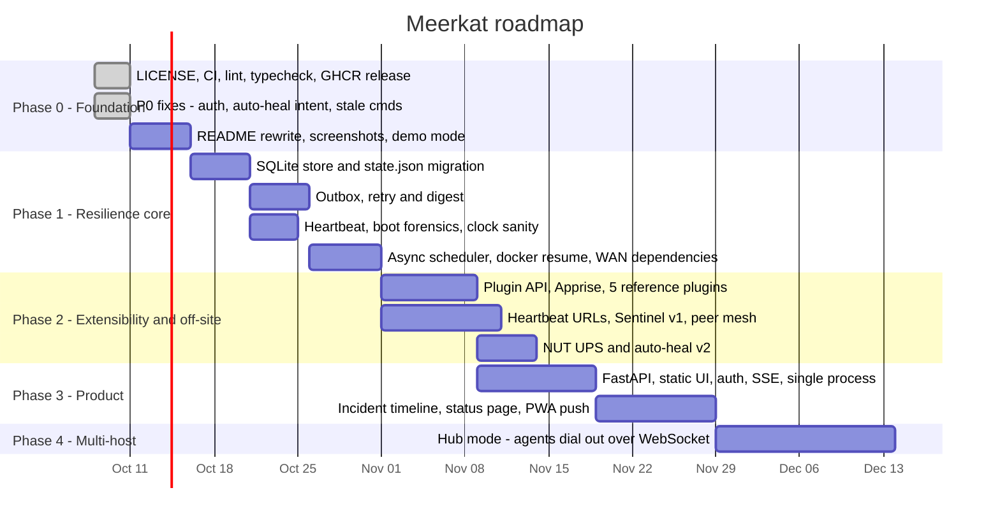
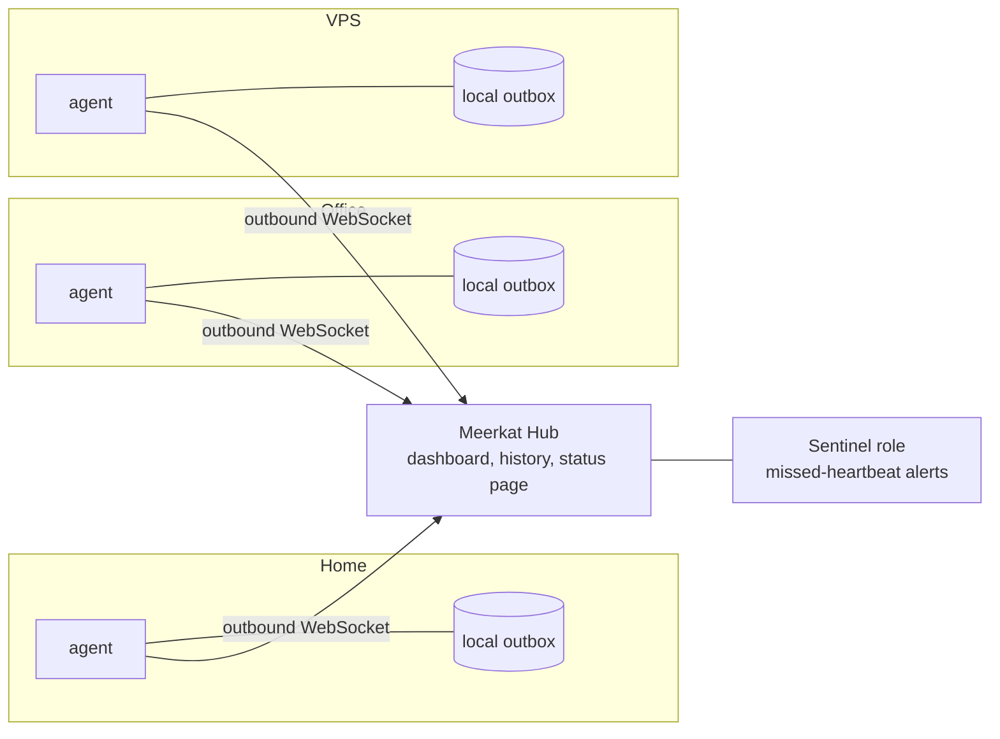

# Meerkat roadmap

**Goal:** turn Meerkat from a single-server script into the homelab agent that **tells you what happened while you were offline**. It should survive long network outages, power cuts and server downtime without losing alerts, and it should be easy for anyone to extend.

Contents:

- [1. Where Meerkat is today](#1-where-meerkat-is-today)
- [2. Issue audit](#2-issue-audit)
- [3. Positioning](#3-positioning)
- [4. Target architecture](#4-target-architecture)
- [5. Resilience plan](#5-resilience-plan)
- [6. Security hardening](#6-security-hardening)
- [7. Missing features and contributor backlog](#7-missing-features--contributor-backlog)
- [8. Timeline](#8-timeline)
- [9. Growth plan](#9-growth-plan)

---

## 1. Where Meerkat is today

Meerkat already has several features other tools lack:

- two-way Telegram chat-ops
- Docker lifecycle events
- detection of NIC and default-route failover
- an auto-heal loop
- quiet, state-change-only alerting

The problems are that it loses alerts exactly when they matter, it has no contributor on-ramp, and it does not yet have a clear pitch against larger projects. See [ARCHITECTURE.md](ARCHITECTURE.md#current-architecture) for the current design.

---

## 2. Issue audit

Status: ✅ fixed on this branch · 🟡 planned (phase noted)

### P0: correctness and security

| # | Issue | Where | Status |
|---|---|---|---|
| 1 | Alerts are dropped when the network is down: `send()` logs the error and discards the message. There is no outbox or retry. | `monitors/telegram.py` | 🟡 Phase 1 (outbox) |
| 2 | Action endpoints were open when no token was configured. | `monitors/api.py` | ✅ Token is now always required and auto-generated if missing |
| 3 | GET endpoints have no auth, which leaks the container inventory and network details. | `monitors/api.py` | 🟡 Phase 3 (UI login). Documented in SECURITY.md |
| 4 | The Python API `/` raised `TypeError`. `dashboard_html` was defined four times and the last copy took no arguments. That was about 2,000 lines of dead HTML. | `monitors/api.py` | ✅ Dead copies removed, all pages render |
| 5 | Auto-heal fought the user: it restarted containers after a deliberate `docker stop` and bounced unplugged Ethernet forever. | `monitors/autofix.py` | ✅ It now respects user stops (from Docker events) and skips links with no carrier or a missing interface |
| 6 | Auto-heal messages bypassed `/silence`. | `monitors/autofix.py` | ✅ |
| 7 | Python runs in the background behind Node (PID 1) with no supervision, and SIGTERM never reaches it. | `Dockerfile` | 🟡 Phase 3 (single process under `tini`) |
| 8 | No LICENSE file. | repo root | ✅ Apache-2.0 |

### P1: resilience

| # | Issue | Where | Status |
|---|---|---|---|
| 9 | `state.json` is rewritten in full on every `set()` with no fsync and no backup. Corruption silently resets all state and wears SD cards. | `monitors/state.py`, `monitors/sites.py` | 🟡 Phase 1 (SQLite store) |
| 10 | No detection of power cuts or downtime. The boot message does not say how long the host was down or why. | `app.py` | 🟡 Phase 1 (boot forensics) |
| 11 | Docker events are lost while the event stream is disconnected (no `since=` on reconnect). | `monitors/docker.py` | 🟡 Phase 1 |
| 12 | Boot storm: after a power cut, every container start becomes its own Telegram message. There is no rate limit. | `monitors/docker.py`, `monitors/telegram.py` | 🟡 Phase 1 |
| 13 | Telegram commands queued during an outage ran hours later. | `monitors/commands.py` | ✅ Stale destructive commands are ignored, with a reply |
| 14 | Checks run sequentially, so slow sites (10s timeout each) delay all other checks. | `app.py`, `monitors/sites.py` | 🟡 Phase 1 (async scheduler) |
| 15 | Durations use the wall clock, which jumps on boards with no RTC after NTP sync. | `monitors/alerts.py` | 🟡 Phase 1 |
| 16 | The internet check is ICMP only. It cannot tell gateway, ISP and DNS failures apart. | `monitors/internet.py` | 🟡 Phase 1 (WAN dependency chain) |
| 17 | `history.db` has no retention, and `/silence` has no expiry. | `monitors/history.py`, `monitors/commands.py` | 🟡 Phase 1 |

### P2: quality and developer experience

| Issue | Status |
|---|---|
| No CI, lint, type-check or image build. The README points at a GHCR image that nothing publishes. | ✅ `ci.yml` (ruff, mypy, unit tests, Next build, Docker build) and `release.yml` (multi-arch GHCR with SBOM and provenance) |
| `validate_config` required a network interface, which broke on VPS, macOS and Windows hosts. | ✅ Interfaces are optional |
| `api.port: 8710` in the sample config collided with the web UI. | ✅ Changed to `8711` |
| `/metrics` and `/api/health` block for 1s on `cpu_percent(interval=1)` and spawn `ip route` on every request. | 🟡 Phase 1 (serve cached readings) |
| Site checks read the whole response body with no size cap. Disk alert IDs are mangled (`/mnt/x` becomes `rootmntrootx`). | 🟡 good first issue |
| The Next proxy forwards every request header, including cookies, to the backend. The action token is kept in `localStorage`. | 🟡 Phase 3 |
| The README is written for one specific server and has no screenshots or demo. | 🟡 Phase 0 follow-up |

---

## 3. Positioning

See [COMPETITIVE_ANALYSIS.md](COMPETITIVE_ANALYSIS.md) for the full comparison.

> Uptime Kuma answers *"is my website up?"*. Beszel answers *"how are my servers doing?"*. **Meerkat answers *"something broke at home while I was away: what happened, did it fix itself, and what do I need to do?"***

Meerkat's moat is outage-awareness:

- an offline outbox and "while you were away" digest
- power-cut forensics on boot
- an external Sentinel
- UPS awareness
- intent-aware auto-heal
- two-way chat-ops

Meerkat should integrate with those tools instead of trying to replace them.

---

## 4. Target architecture

The full diagrams are in [ARCHITECTURE.md](ARCHITECTURE.md#target-architecture). In summary:

- **One asyncio Python process** under `tini`, with the Next.js UI built as a static export and served by FastAPI. This removes Node from the runtime image and the unsupervised background process.
- **SQLite as the only store:** key/value state, events, metric rollups, the outbox and lifecycle data.
- **A plugin registry** for monitors, notifiers and actions, discovered via entry points with pydantic config schemas.
- **An alert engine** with dependencies, flap detection, maintenance windows and silences that expire.
- **An outbox dispatcher** with retries, rate limits, digests and channel failover.
- **An off-site Sentinel and peer mesh** for when the host itself is down.

---

## 5. Resilience plan

| Scenario | What Meerkat will do |
|---|---|
| **Long network outage** | Commit every alert to the outbox before sending, and retry with backoff. On reconnect, send one digest ("Internet was down 10:02-12:15 (ISP); nextcloud died and was auto-healed; disk 91% for 40m"). Use the gateway → DNS → HTTPS chain to find the root cause and mute dependent alerts. Use a LAN-only channel (ntfy or Home Assistant) for phones on home Wi-Fi. Ignore stale commands *(done)*. Resume the Docker event stream with `since=`. |
| **Long power cut** | Use crash-safe SQLite. Write a heartbeat every 30s and a clean-shutdown flag. On boot, classify what happened (crash, planned reboot or power loss) with exact downtime, but only after NTP sync. Aggregate the boot storm into one message. Use the NUT UPS monitor to alert on battery *before* the host dies. |
| **Long server downtime** | Ping `heartbeat.urls` (healthchecks.io or an Uptime Kuma push monitor). Add Meerkat Sentinel (off-site, keeps the last snapshot for context). Add a peer mesh between agents. Add watchdogs on internal tasks, reflected in the Docker `HEALTHCHECK`. |

The sequence diagrams for each scenario are in [ARCHITECTURE.md](ARCHITECTURE.md#failure-scenarios).

---

## 6. Security hardening

- ✅ Action endpoints always require a token. If none is configured, one is generated on first start, logged once, and persisted.
- Bind the API to `127.0.0.1` by default once the UI is served by the same process.
- Web UI login with session cookies, then OIDC, with separate read-only and action roles.
- A documented least-privilege profile: `cap_add: [NET_ADMIN]` instead of `privileged`, and Docker access through a socket proxy limited to the endpoints Meerkat needs. Add `actions.enabled: false` read-only mode to the docs.
- An audit trail for every action: who did it, through which channel, and the result.
- ✅ Dependabot, SBOM and build provenance on release images. CodeQL next.

---

## 7. Missing features & contributor backlog

### Core work (maintainers)

- An async scheduler with per-monitor intervals and timeouts.
- The SQLite store, with migration from `state.json`.
- The outbox, retry logic and digest.
- Lifecycle tracking and boot forensics.
- The plugin API.
- Alert dependencies, maintenance windows, and silences that expire.
- Config hot-reload and a `meerkat validate` CLI.
- FastAPI with SSE live updates.

### Good first issues

Each of these is a self-contained plugin of about 50-150 lines plus a test.

**Monitors**
- TCP port open
- DNS record matches
- TLS certificate expiry
- Domain expiry
- Ping latency, jitter and packet loss
- Gateway reachability
- Public IP changed
- Scheduled speedtest
- SMART disk health
- ZFS and mdadm pool status
- NUT UPS status
- systemd unit state
- Docker healthcheck `unhealthy`
- Container restart loop
- Container image update available
- Log pattern match
- Mount point present
- Swap and load average
- Fan RPM
- NVIDIA GPU temperature

**Notifiers**
- Apprise bridge (100+ services at once)
- Discord
- Slack
- ntfy
- Gotify
- Pushover
- Matrix
- SMTP email
- Generic webhook with templates
- MQTT with Home Assistant discovery

**Actions**
- Run a script hook
- `docker compose up -d` for a project
- Wake-on-LAN
- Start a Proxmox VM
- Graceful shutdown on UPS low battery

**Chat-ops**
- Discord bot with the same commands as Telegram
- Inline confirm buttons ("Restart? ✅/❌")
- `/silence 2h`
- `/ack <alert>`
- `/logs <container> 50`
- `/uptime`
- `/digest`

**Web UI**
- Incident timeline
- Public status page
- Config editor with schema validation
- PWA with web push
- i18n

**Integrations**
- Uptime Kuma status import
- Prometheus remote-write
- Grafana dashboard JSON
- Home Assistant add-on
- Unraid, TrueNAS and CasaOS templates

### Auto-heal v2

- Opt in with the `meerkat.autoheal=true` label or a config allowlist.
- Heal on `die` with a non-zero exit code or on a healthcheck reporting `unhealthy`. Never heal after a user stop *(done)*.
- Use exponential backoff with a maximum number of attempts, then escalate ("gave up after 5 tries").
- Bounce a NIC only when it has carrier but no address or route *(done)*.

---

## 8. Timeline

### Phase exit criteria

| Phase | Done when |
|---|---|
| 0 | CI is green on `main`. `ghcr.io/xrg360/meerkat` publishes amd64 and arm64 images. The README has a GIF and quick start. |
| 1 | Pull the WAN cable for 2 hours: one digest arrives on reconnect and nothing is lost. Pull the power: the boot message reports the downtime correctly. |
| 2 | A new notifier can be added in its own package with no core change. Killing the host triggers a Sentinel alert within 2 intervals. |
| 3 | One process and one port. Login is required for actions. The image is under 150 MB. |
| 4 | Three agents report to one hub. If the hub is down, agents keep alerting on their own and back-fill the hub later. |

### Phase 4: multi-host hub (sketch)

Agents never need inbound ports. Each one keeps alerting through its own outbox when the hub is unreachable, and back-fills the hub's history on reconnect.

---

## 9. Growth plan

1. **Remove the blockers.**
   - ✅ LICENSE, CONTRIBUTING, Code of Conduct, SECURITY policy, issue and PR templates, CI and Dependabot.
   - Next: create the labels (`good first issue`, `help wanted`, `plugin`), enable GitHub Discussions, and publish a GitHub Project board for this roadmap.
2. **Make the README sell in 10 seconds.**
   - Hero line: "Know what happened while you were offline."
   - A 15-second GIF of the outage digest on a phone.
   - The comparison table, a one-command install, and `MEERKAT_DEMO=1` simulated outages so people can try it safely.
3. **Make contributing frictionless.**
   - A plugin cookbook and a `meerkat new-plugin` scaffold.
   - A devcontainer, plus fake Docker and network fixtures.
   - CI that finishes in under 3 minutes.
   - Every good-first-issue should take one evening.
4. **Distribute widely.**
   - amd64 and arm64 images (Raspberry Pi).
   - A Home Assistant add-on.
   - Unraid, TrueNAS and CasaOS templates.
   - A Proxmox helper script.
5. **Launch around the power-cut story.**
   - Show HN, r/selfhosted and r/homelab posts, and the selfh.st newsletter.
   - Submit to awesome-selfhosted once it is eligible (licensed, and about 4 months after the first release).
6. **Keep a steady cadence.**
   - Semantic versioning via release-please, and a CHANGELOG.
   - A monthly release with contributor shout-outs.
   - Discussions for plugin requests.
